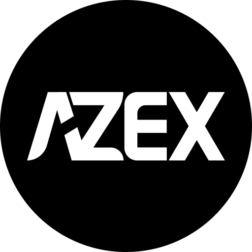
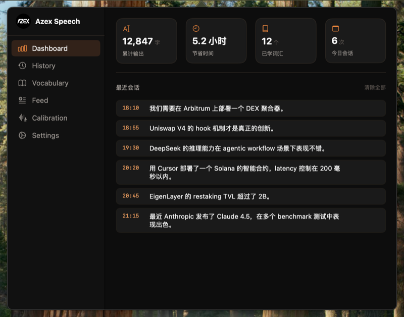
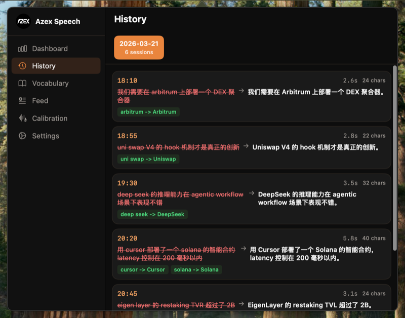
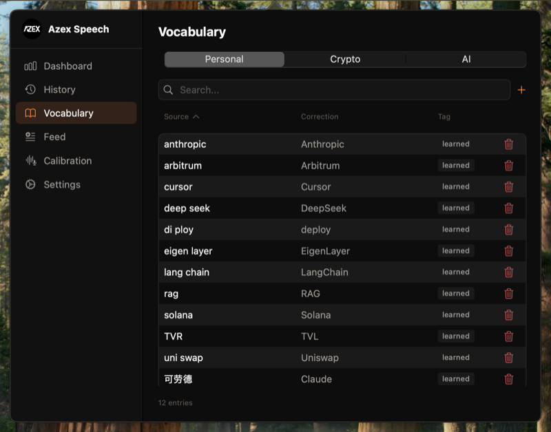
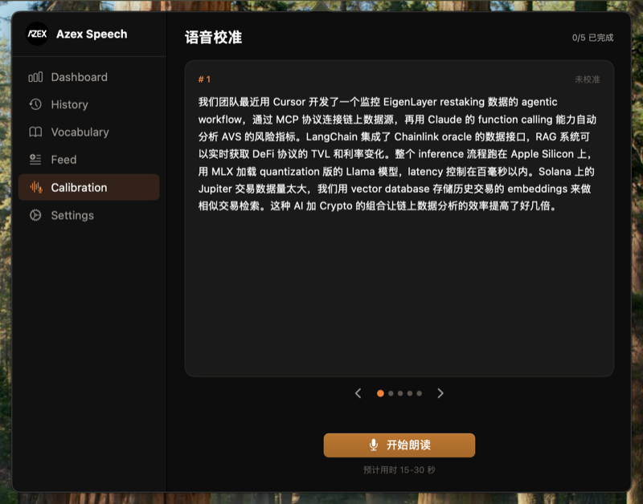
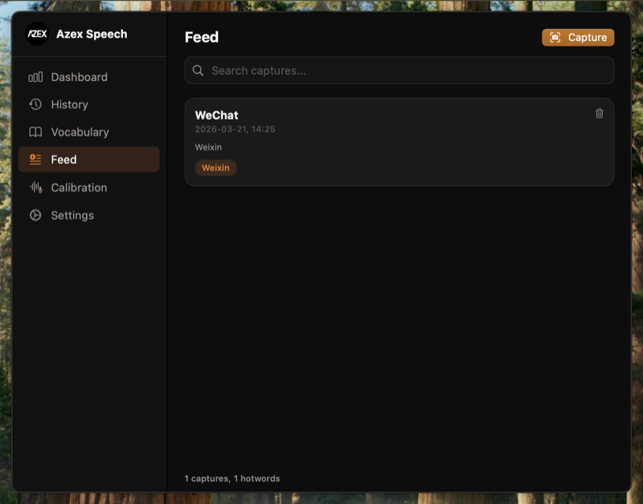
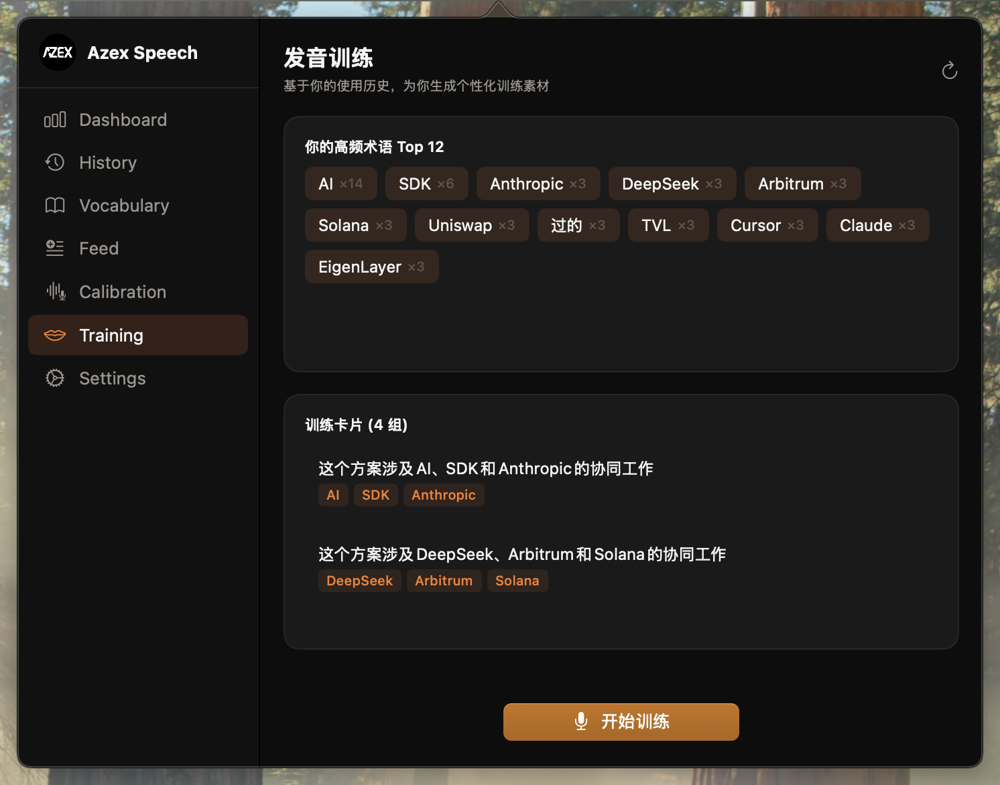
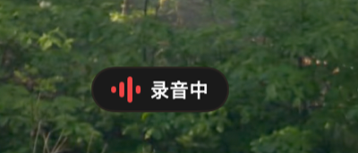

# Azex Speech

<p align="center">
  
</p>

<p align="center">
  <strong>macOS 原生语音输入，专为非英语母语的 Crypto + AI 从业者打造</strong><br>
  <em>Native macOS voice input — built for non-native English speakers in Crypto & AI</em>
</p>

<p align="center">
  <a href="https://speech.azex.ai">Website</a> ·
  <a href="#快速开始">Quick Start</a> ·
  <a href="#核心亮点">Features</a> ·
  <a href="https://github.com/azex-ai/speech/releases">Releases</a>
</p>

---

## 解决什么问题？

你用中文工作，但你的行业充满英文术语。

你每天要说 "EigenLayer"、"agentic workflow"、"Uniswap V4"——但你不是英语母语者。你的发音可能不标准，你会中英文混着说，你会用中文音去读英文词。

**现有的语音输入工具完全不懂你在说什么。**

Azex Speech 专门为这种场景设计：你的英语发音不需要完美，系统会学习你的口音和用词习惯，把 "可劳德" 纠正成 "Claude"，把 "衣根 layer" 识别为 "EigenLayer"。用得越多，识别越准。

### 适合谁？

- 🌏 **非英语母语的开发者** — 用中文思考，但工作中离不开英文技术术语
- 🔤 **中英混说** — 一句话里 "我用 Cursor 部署了一个 Solana 合约"，不想切输入法
- 🗣️ **发音不标准也没关系** — 系统会从你的纠正中学习你的个人发音模式
- ₿ **Crypto / AI 从业者** — 内置领域词库，DeFi、LLM、协议名全覆盖
- ⌨️ **想用嘴代替键盘** — 说话比打字快 3-4 倍，尤其是长段中文

---

## 核心亮点

### 🎯 专治发音不标准 + 中英混说

你说的 | 通用工具识别 | Azex Speech
--- | --- | ---
"可劳德" | 可劳德 ❌ | Claude ✅
"衣根 layer" | 衣根 layer ❌ | EigenLayer ✅
"TVR 超过了 2B" | TVR 超过了 2B ❌ | TVL 超过了 2B ✅
"deep seek 的推理" | deep seek 的推理 ❌ | DeepSeek 的推理 ✅
"uni swap V4" | uni swap V4 ❌ | Uniswap V4 ✅

不是靠 ASR 引擎本身多强——是靠我们在 ASR 之上的四层纠错。

### 🧠 四层纠错，越用越懂你

```
ASR 引擎（FireRedASR v2 CTC，中英双语 SOTA）
  ↓ 原始识别
领域词库（1800+ Crypto/AI/编程术语预置）
  ↓ 术语纠正
上下文感知（自动读取当前窗口的代码、聊天记录作为热词）
  ↓ 热词加持
隐式学习（你的每次纠正都自动记住，适应你的口音）
  ↓ 个人化
最终输出 → 自动粘贴到目标窗口
```

关键区别：**别的语音工具只有 ASR 一层。我们有四层叠加。**

### 🗣️ 个人口音校准 + 发音训练

内置 Flashcard 式校准系统——朗读一段领域文本，系统自动对比识别结果和标准文本，找出你的发音特征并记录为纠正规则。

**发音训练模块**会自动分析你的使用历史，找出高频术语，生成个性化训练卡片。朗读训练句子，系统实时反馈哪些术语发音正确、哪些需要练习。连续通过 3 次即标记为"已掌握"。越练越准，让系统纠错和你的发音同步进步。

### 🔒 100% 本地，零隐私顾虑

- 音频**永远不上传** — 所有识别在你的 Mac 上完成
- 数据是本地 JSON 文件 — 你可以直接打开编辑
- 无需注册、无需登录、无需联网

### ⚡ 说话比打字快 3-4 倍

程序员平均中文打字约 40 字/分钟，说话约 150 字/分钟。Dashboard 会实时告诉你已经省了多少时间。

---

## 产品截图

<table>
<tr>
<td width="50%">

**Dashboard — 使用统计 + 最近会话**



追踪累计输出字数、节省时间、已学词汇。每条会话支持复制和删除。

</td>
<td width="50%">

**History — 纠错对比记录**



原始识别（红色删除线）→ 纠正后（白色加粗），学习到的词对标绿。

</td>
</tr>
<tr>
<td width="50%">

**Vocabulary — 词库管理**



个人词库（可编辑）+ Crypto/AI 领域词库（只读），支持搜索和手动添加。

</td>
<td width="50%">

**Calibration — 语音校准**



Flashcard 式校准卡片，每领域 5 段文本，朗读后自动生成纠正规则。

</td>
</tr>
<tr>
<td width="50%">

**Feed — 上下文语料**



一键抓取当前窗口文本，自动提取专有名词作为识别热词。

</td>
<td width="50%">

**Training — 发音训练**



基于使用历史自动生成训练素材，高频术语 Top N + 训练卡片，朗读后实时反馈。

</td>
</tr>
<tr>
<td width="50%">

**录音指示器**



紧凑胶囊 HUD，录音中 → 识别中 → 已粘贴。多屏自动跟随鼠标位置。

</td>
<td width="50%">
</td>
</tr>
</table>

---

## 快速开始

### 要求
- macOS 14.0+ (Sonoma)
- Apple Silicon (M1/M2/M3/M4)
- Xcode 16+

### 方式一：直接下载（推荐）

从 [Releases](https://github.com/azex-ai/speech/releases) 下载最新 DMG → 拖到 Applications → 打开即用。模型已内嵌，无需额外下载。

### 方式二：从源码构建

```bash
git clone https://github.com/azex-ai/speech.git
cd speech
bash Scripts/setup.sh                              # 下载框架 + 模型（首次）
swift build && swift run AzexSpeech
```

### 使用方式

```
按右 Option → 🔴 录音中
说话...
再按右 Option → ⏳ 识别中 → ✅ 自动粘贴
```

| 操作 | 说明 |
|------|------|
| 右 Option | 开始/停止录音 |
| ⌥Space | 备选快捷键（可自定义） |
| 点击菜单栏 🎵 | 打开控制面板 |

---

## 技术架构

| 组件 | 选型 | 说明 |
|------|------|------|
| 语言 | Swift 6 + SwiftUI | macOS 原生 |
| ASR | [sherpa-onnx](https://github.com/k2-fsa/sherpa-onnx) FireRedASR v2 CTC | 中英双语 SOTA，int8 量化 ~740MB，内嵌于 App |
| 纠正 | 规则替换 + Levenshtein diff | Phase 3 接入 MLX 本地模型 |
| 上下文 | AXUIElement API | 读取活跃窗口文本 |
| 输入 | NSPasteboard + CGEvent | 模拟 Cmd+V 粘贴 |
| 数据 | JSON 文件 | 无数据库，本地存储 |

## 路线图

- [x] **Phase 1** — ASR 管线 + 三层词库 + 自动粘贴
- [x] **Phase 2** — 完整 UI + Onboarding + Dashboard + 校准
- [x] **Phase 2.5** — FireRedASR v2 CTC 升级 + 1800+ 词库 + 发音训练模块
- [ ] **Phase 3** — MLX 本地小模型智能纠正（上下文理解）
- [ ] **Phase 4** — Azex 账户 + 远程 LLM + 加密货币支付

## 致谢

- [sherpa-onnx](https://github.com/k2-fsa/sherpa-onnx) — ASR 推理引擎 (Apache 2.0)
- [voxt](https://github.com/hehehai/voxt) — 中文语音 App 参考 (Apache 2.0)
- [OpenWhispr](https://github.com/OpenWhispr/openwhispr) — 自动学习词典 (MIT)

---

<p align="center">
  <strong>MIT © <a href="https://azex.ai">Azex AI</a></strong><br>
  <sub>Built for non-native English speakers in Crypto & AI</sub>
</p>
